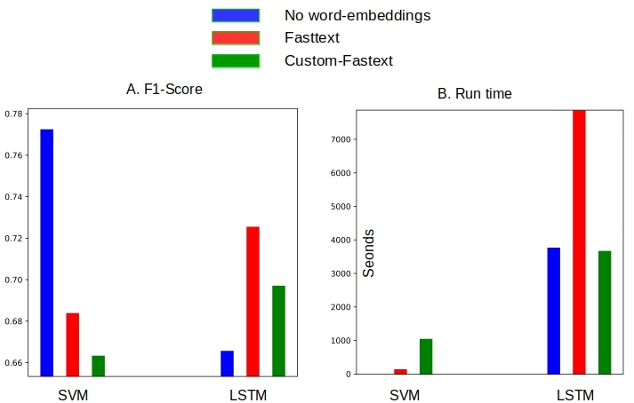

# Multiclass Classification with Word Bags and Word Sequences
  
This is the source code to go along with the blog article

[Multiclass Classification with Word Bags and Word Sequences](http://xplordat.com/2019/02/21/multiclass-classification-with-word-bags-and-word-sequences/)

The blog evaluates the sequence respecting Long Short Term Memory (LSTM) neural nets approach to classifying 20-newsgroups articles against the traditional Support Vector Machines (SVM) approach using tf-idf vectors

## Dependencies

	numpy
	scikit-learn
	keras
	tensorflow
	matplotlib

## LSTM Model

A simple LSTM model is implemented via Keras/Tensorflow

## Word Vectors

Download the 300-dim Fasttext vectors [crawl-300d-2M-subword.zip](https://fasttext.cc/docs/en/english-vectors.html) unzip and place them in the 'vectors' directory

The Gensim generated custom word-vectors are provided in this repo. Unzip the file.

	cd vectors
	unzip 20news-fasttext.json.zip

The contents of 'vectors' directory should have both the custom & pre-trained word vectors like below

	ls vectors
		20news-fasttext.json  crawl-300d-2M-subword.vec

## Usage

The simulations are run with the shell script

	./classify-20news.sh

##	Plot the Confusion Matrices

	pipenv run python ./plotConfusionMatrix.py

A comparison of the best confusion matrices obtained with LSTM and SVM:
	

##	Plot the F1-scores and Elapsed time

	pipenv run python ./plots.py

